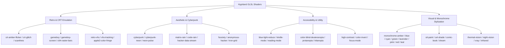
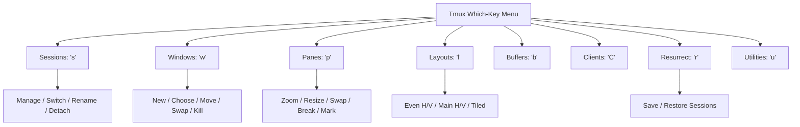

# 🌌 Arch Linux Dotfiles

[](https://archlinux.org/)
[](https://hyprland.org/)
[](https://neovim.io/)
[](https://github.com/tmux/tmux)
[](https://starship.rs/)
[](https://www.zsh.org/)
[](https://github.com/catppuccin/catppuccin)

A meticulously crafted, high-performance dotfiles configuration for **Arch Linux**. Powered by the **Hyprland** dynamic tiling Wayland compositor, a custom modular **Neovim** setup (`trespasser`), a modern **Tmux** workspace with interactive which-key menus, **Starship** cross-shell prompt with Catppuccin Mocha aesthetics, and an extensive library of 90+ real-time GLSL screen shaders.

---

## 📑 Table of Contents

- [Overview & Architecture](#-overview--architecture)
- [Directory Layout](#-directory-layout)
- [Hyprland & Wayland Environment](#-hyprland--wayland-environment)
  - [Key Features](#key-features)
  - [Hyprland Keybindings](#hyprland-keybindings)
  - [GLSL Shaders Collection](#glsl-shaders-collection)
- [Neovim Configuration (`trespasser`)](#-neovim-configuration-trespasser)
  - [Plugin Ecosystem](#plugin-ecosystem)
  - [Keymaps & Workflow](#keymaps--workflow)
- [Tmux Setup](#-tmux-setup)
  - [Status Bar & Controls](#status-bar--controls)
  - [Interactive Which-Key Menu](#interactive-which-key-menu)
- [Shell & Prompt (Zsh + Starship)](#-shell--prompt-zsh--starship)
- [Package Manifests](#-package-manifests)
- [Installation & Quickstart](#-installation--quickstart)
  - [1. Clone Repository](#1-clone-repository)
  - [2. Install Packages](#2-install-packages)
  - [3. Symlink Configurations](#3-symlink-configurations)
  - [4. Setup Plugins & Fonts](#4-setup-plugins--fonts)
- [License](#-license)

---

## ⚡ Overview & Architecture

This repository is built with a modular, maintainable, and frictionless pairing philosophy:

- **Compositor**: [Hyprland](https://hyprland.org/) on Wayland with NVIDIA hardware acceleration environment flags, seamless lock/idle power management (`hypridle`, `hyprlock`), and zero-gap window tiling.
- **Editor**: Custom Neovim (`trespasser`) configured in Lua using [`lazy.nvim`](https://github.com/folke/lazy.nvim), featuring lightning-fast autocompletion ([`blink.cmp`](https://github.com/Saghen/blink.cmp)), AST navigation ([Treesitter](https://github.com/nvim-treesitter/nvim-treesitter)), buffer file management ([`oil.nvim`](https://github.com/stevearc/oil.nvim)), and Mason LSP integration.
- **Multiplexer**: [Tmux](https://github.com/tmux/tmux) with seamless Neovim navigation ([`vim-tmux-navigator`](https://github.com/christoomey/vim-tmux-navigator)), dual prefix (`Ctrl+Space` / `Ctrl+b`), session resurrection (`tmux-resurrect` + `tmux-continuum`), and an interactive popup menu (`tmux-which-key`).
- **Shell**: [Zsh](https://www.zsh.org/) + [Oh-My-Zsh](https://ohmyz.sh/) with syntax highlighting, autosuggestions, dynamic `.nvmrc` auto-switching on directory traversal, and [Starship](https://starship.rs/) powerline prompt styled with Catppuccin Mocha.
- **Visuals**: A massive built-in suite of **90+ GLSL post-processing shaders** for Hyprland ranging from retro CRT/VHS effects to high-contrast accessibility and cyberpunk vibes.

---

## 📁 Directory Layout

```
.
├── hypr/                        # Hyprland Compositor configuration
│   ├── autostart.conf           # Background services and daemons
│   ├── bindings.conf            # Application and window keybindings
│   ├── envs.conf                # Environment variables
│   ├── hypridle.conf            # Idle timeouts, lock triggers & sleep inhibitor
│   ├── hyprland.conf            # Master entrypoint config (sources modular files)
│   ├── hyprlock.conf            # Lockscreen visual layout and PAM authentication
│   ├── hyprsunset.conf          # Blue-light filter profiles
│   ├── input.conf               # Keyboard (caps:escape), touchpad, mouse sensitivity
│   ├── looknfeel.conf           # Gaps, border radius, layout settings
│   ├── monitors.conf            # Resolution, refresh rate (165Hz), scaling (1.25x)
│   ├── shaders/                 # 90+ custom GLSL screen effect shaders
│   └── xdph.conf                # XDG Desktop Portal Hyprland config
├── nvim/                        # Modular Lua Neovim configuration
│   ├── init.lua                 # Leader definition (<Space>) and entrypoint
│   ├── lazy-lock.json           # Pinned lockfile for all Neovim plugins
│   └── lua/trespasser/
│       ├── init.lua             # Module loader (lazy, remap, set)
│       ├── lazy.lua             # lazy.nvim bootstrapper and plugin importer
│       ├── remap.lua            # Global keymaps & ergonomic shortcuts
│       ├── set.lua              # Core Vim options (relative numbers, undo dir, etc.)
│       └── plugins/             # Dedicated plugin specification modules
│           ├── aether.lua       # Theme & colorscheme configuration
│           ├── autopairs.lua    # Automatic pair completion
│           ├── blink.lua        # Ultra-fast fuzzy completion engine
│           ├── comment.lua      # Code commenting gestures
│           ├── conform.lua      # Multi-language formatter (prettier, stylua, black)
│           ├── flash.lua        # Fast jump navigation
│           ├── fugitive.lua     # Git integration (:Git / <leader>gs)
│           ├── gitsigns.lua     # Git diff signs and hunk controls
│           ├── harpoon.lua      # ThePrimeagen's Harpoon2 quick buffer pin/jump
│           ├── lazygit.lua      # Floating LazyGit terminal window
│           ├── lsp.lua          # Native LSP configurations & keymaps
│           ├── lualine.lua      # Statusline with devicons
│           ├── mason.lua        # LSP / Formatter package manager
│           ├── mason-lspconfig.lua
│           ├── oil.lua          # File explorer as a buffer
│           ├── surround.lua     # Manipulate surrounding delimiters
│           ├── telescope.lua    # Telescope fuzzy finder
│           ├── telescope-fzf.lua# C-based native FZF sorter
│           ├── todo-comments.lua# TODO/FIXME finder & highlighter
│           ├── treesitter.lua   # AST syntax highlighting & textobjects
│           ├── trouble.lua      # Diagnostic lists & workspace issues
│           ├── undotree.lua     # Persistent undo tree visualizer
│           ├── vim-tmux-navigator.lua # Seamless tmux/nvim split navigation
│           └── which-key.lua    # Interactive keymap cheatsheet popup
├── tmux/                        # Tmux workspace configuration
│   ├── .tmux.conf               # Multi-prefix, top bar, vim keys, TPM plugins
│   ├── which-key.json           # Interactive popup keymap definition
│   └── bin/
│       └── tmux-launcher        # Smart launcher: auto-attach or prompt for session name
├── starship/
│   └── starship.toml            # Catppuccin Mocha powerline prompt configuration
├── zsh/
│   └── .zshrc                   # Zsh configuration, NVM auto-loader, aliases
├── packages/
│   ├── arch-packages.txt        # Official Arch Linux repository package manifest
│   └── aur-packages.txt         # AUR package manifest
├── .gitignore                   # Ignore caches, node_modules, secrets, backup files
└── README.md                    # Repository documentation
```

---

## 🪟 Hyprland & Wayland Environment

### Key Features
- **NVIDIA Optimization**: Hardware-accelerated Wayland backend variables (`LIBVA_DRIVER_NAME,nvidia`, `__GLX_VENDOR_LIBRARY_NAME,nvidia`, `NVD_BACKEND,direct`).
- **Ergonomic Inputs**:
  - `Caps Lock` mapped as `Escape` for rapid modal navigation.
  - Keyboard repeat rate set to `40` with a `600ms` delay.
  - Natural touchpad scrolling enabled with fine-tuned per-terminal scrolling sensitivity (`0.2` on Ghostty, `1.5` on Alacritty/Kitty).
- **Zero-Distraction Layout**: Gapless (`gaps_in = 0`, `gaps_out = 0`) clean tiling maximizing screen real estate.
- **Power & Session Security**: `hypridle` manages display sleep, screensaver timeout (150s), lock triggers (152s) with PAM readiness delay on wake, and `hyprlock` authentication screen.

### Hyprland Keybindings

| Keybinding | Action | Description |
| :--- | :--- | :--- |
| `Super + Enter` | Terminal | Launch terminal in current working directory (`omarchy-cmd-terminal-cwd`) |
| `Super + Alt + Enter` | Smart Tmux | Launch or attach Tmux session via `tmux-launcher` in current directory |
| `Super + Shift + Enter` | Web Browser | Launch default browser |
| `Super + B` | Web Browser | Quick launch default browser (`$browser`) |
| `Super + Shift + B` | Private Browser | Launch browser in private / incognito mode |
| `Super + N` | Code Editor | Launch default GUI / TUI editor |
| `Super + Shift + F` | File Manager | Open Nautilus file manager in home |
| `Super + Alt + Shift + F` | File Manager (CWD) | Open Nautilus in active terminal directory |
| `Super + Shift + T` | System Monitor | Open `btop` process & resource monitor |
| `Super + D` | Docker UI | Open `lazydocker` container management TUI |
| `Super + Q` | Kill Window | Close / kill currently active window |

---

### 🎨 GLSL Shaders Collection

This repository includes a collection of over **90 high-performance GLSL shaders** located in [`hypr/shaders/`](file:///home/trespasser/dotfiles/hypr/shaders). Shaders can be applied dynamically to the display using `hyprctl keyword decoration:screen_shader <path-to-shader>`.



---

## 💻 Neovim Configuration (`trespasser`)

The Neovim configuration is structured under the `trespasser` Lua namespace, configured cleanly from scratch without heavy monolithic distributions.

```
nvim/
├── init.lua                      # Sets mapleader = " " and imports trespasser
└── lua/trespasser/
    ├── init.lua                  # Loads lazy -> remap -> set
    ├── set.lua                   # Vim options
    ├── remap.lua                 # Core keybindings
    ├── lazy.lua                  # lazy.nvim package manager
    └── plugins/                  # 20+ fine-tuned plugin specs
```

### Plugin Ecosystem

| Category | Plugins | Details |
| :--- | :--- | :--- |
| **Completion & LSP** | [`blink.cmp`](https://github.com/Saghen/blink.cmp), [`nvim-lspconfig`](https://github.com/neovim/nvim-lspconfig), [`mason.nvim`](https://github.com/williamboman/mason.nvim), [`mason-lspconfig.nvim`](https://github.com/williamboman/mason-lspconfig.nvim) | Built-in LSP support for `lua_ls`, `ts_ls`, `pyright`, `clangd` with friendly-snippets. |
| **Code Formatting** | [`conform.nvim`](https://github.com/stevearc/conform.nvim) | Auto-formatters: `stylua` (Lua), `prettier` (JS/TS/React/HTML/CSS/JSON), `black` (Python), `clang-format` (C/C++). |
| **Syntax & AST** | [`nvim-treesitter`](https://github.com/nvim-treesitter/nvim-treesitter), [`nvim-treesitter-textobjects`](https://github.com/nvim-treesitter/nvim-treesitter-textobjects) | Highlighting, function/class selection (`af`, `if`, `ac`, `ic`), and jumping (`]m`, `[m`). |
| **Search & Navigation** | [`telescope.nvim`](https://github.com/nvim-telescope/telescope.nvim), [`telescope-fzf-native`](https://github.com/nvim-telescope/telescope-fzf-native.nvim), [`harpoon2`](https://github.com/ThePrimeagen/harpoon), [`flash.nvim`](https://github.com/folke/flash.nvim), [`oil.nvim`](https://github.com/stevearc/oil.nvim) | Blazing fuzzy finding, 2D jump motions, quick buffer pin/swaps, and directory editing as normal buffers. |
| **Git Integration** | [`lazygit.nvim`](https://github.com/kdheepak/lazygit.nvim), [`vim-fugitive`](https://github.com/tpope/vim-fugitive), [`gitsigns.nvim`](https://github.com/lewis6991/gitsigns.nvim) | Git status UI, git blame/diff signs, and integrated popup LazyGit. |
| **Diagnostics & UI** | [`trouble.nvim`](https://github.com/folke/trouble.nvim), [`todo-comments.nvim`](https://github.com/folke/todo-comments.nvim), [`undotree`](https://github.com/mbbill/undotree), [`which-key.nvim`](https://github.com/folke/which-key.nvim), [`lualine.nvim`](https://github.com/nvim-lualine/lualine.nvim) | Diagnostic lists, TODO tracking, branchable undo history, and keybinding prompts. |
| **Editing Enhancements** | [`nvim-autopairs`](https://github.com/windwp/nvim-autopairs), [`nvim-surround`](https://github.com/kylechui/nvim-surround), [`Comment.nvim`](https://github.com/numToStr/Comment.nvim), [`vim-tmux-navigator`](https://github.com/christoomey/vim-tmux-navigator) | Auto delimiter matching, surround text object manipulations, and seamless Tmux-Nvim pane traversal. |

### Keymaps & Workflow

The leader key is set to **`<Space>`**.

#### Navigation & Core Remaps
- **`J` / `K` (Visual Mode)**: Move selected lines up/down with automatic re-indentation (`:m '>+1<CR>gv=gv`).
- **`<C-d>` / `<C-u>`**: Half-page jump centered automatically (`zz`).
- **`n` / `N`**: Search next/previous match centered with folds open (`nzzzv`).
- **`<leader>p` (Visual Mode)**: Paste over selection without overwriting register (`"_dP`).
- **`<leader>y` / `<leader>Y`**: Yank motion or line directly to system clipboard (`"+y`).
- **`<leader>d`**: Delete selection into the black hole register (`"_d`).
- **`<leader>s`**: Global search & replace the word under cursor with substitution prompt.
- **`<leader>x`**: Make active script executable (`chmod +x %`).
- **`<leader>tt` / `<leader>tv`**: Open integrated terminal in horizontal or vertical split.
- **`-`**: Open [Oil.nvim](https://github.com/stevearc/oil.nvim) to edit the current directory like a buffer.

#### LSP & Navigation Keymaps
| Shortcut | Action | Description |
| :--- | :--- | :--- |
| `K` | LSP Hover | Display hover documentation and signature information |
| `gd` / `gD` | Definition / Declaration | Jump to symbol definition or declaration |
| `gi` / `gr` | Implementation / References | List symbol implementations or references |
| `<leader>rn` | Rename Symbol | Rename symbol across workspace |
| `<leader>ca` | Code Action | Trigger available LSP quick-fixes & code actions |
| `<leader>ff` | Find Files | Telescope find files in workspace |
| `<leader>fg` | Live Grep | Telescope search text across codebase |
| `<leader>fb` | Buffers | Telescope switch active buffers |
| `<C-p>` | Git Files | Telescope list tracked git files |
| `<leader>1` - `<leader>4` | Harpoon Jump | Instantly switch to pinned files 1–4 |
| `<leader>gg` | LazyGit | Open interactive floating LazyGit terminal |
| `<leader>gs` | Git Status | Open Vim Fugitive Git status buffer |
| `<leader>u` | UndoTree | Toggle persistent graphical undo history tree |
| `<leader>xx` | Trouble | Toggle project diagnostic overview |
| `s` / `S` | Flash Motion | Jump to any character/word visible on screen |

---

## 🪟 Tmux Setup

The Tmux setup (`tmux/.tmux.conf`) is designed for extreme productivity, resilience, and muscle memory alignment.

```
tmux/
├── .tmux.conf               # Multi-prefix, top bar, vim keys, TPM plugins
├── which-key.json           # Interactive popup keymap definition
└── bin/
    └── tmux-launcher        # Smart launcher: auto-attach or prompt for session name
```

### Status Bar & Controls
- **Smart Launcher (`tmux-launcher`)**: Seamless wrapper script executed from Hyprland (`Super + Alt + Enter`) that auto-attaches to an active session, auto-restores previous state if saved resurrect sessions exist, or interactively prompts for a custom session name.
- **Dual Prefixes**: Primary prefix is `Ctrl + Space`; fallback secondary is `Ctrl + b`.
- **Top Statusline**: Minimalist Catppuccin Mocha aesthetic displaying current session, indexed windows, active mode indicators (`PREFIX`, `COPY`), and timestamp.
- **Splits & Vim Navigation**:
  - `Prefix + |`: Split horizontally.
  - `Prefix + -`: Split vertically.
  - `h`, `j`, `k`, `l`: Vim-style pane selection.
- **Session Management**:
  - `Prefix + N`: Prompt for named session creation (`new-session -A -s <name>`).
- **Persistence**: Sessions automatically persist and restore via [`tmux-resurrect`](https://github.com/tmux-plugins/tmux-resurrect) and [`tmux-continuum`](https://github.com/tmux-plugins/tmux-continuum).

### Interactive Which-Key Menu

Equipped with [`tmux-which-key`](https://github.com/Nucc/tmux-which-key) via [`which-key.json`](file:///home/trespasser/dotfiles/tmux/which-key.json) providing a rich, centered popup menu for all actions:



---

## 🐚 Shell & Prompt (Zsh + Starship)

### Zsh (`zsh/.zshrc`)
- **Framework**: Powered by [Oh-My-Zsh](https://ohmyz.sh/) with `git`, `zsh-autosuggestions`, and `zsh-syntax-highlighting`.
- **Node Version Management (NVM)**: Includes an automated `chpwd` directory hook (`load-nvmrc`) that automatically runs `nvm use` when traversing into any directory containing a `.nvmrc` file.
- **Scaffolding Helper**: `newnode <project-name>` helper function to rapidly instantiate TypeScript Node.js templates with pnpm and git initialization.
- **Tooling PATHs**: Configured for local bins, Antigravity CLI, Turso, and Google Cloud SDK.

### Starship (`starship/starship.toml`)
The [Starship](https://starship.rs/) prompt is themed with **Catppuccin Mocha** featuring:
- OS distribution icons (Arch `󰣇`, Ubuntu, Fedora, Debian, etc.).
- Truncated path display with folder glyph substitutions (`Documents 󰈙`, `Music 󰝚`, `Developer 󰲋`).
- Git branch name and dirty/ahead/behind status indicators.
- Dynamic runtime version badges for Node.js, Rust, Go, Python, C, Java, Kotlin, Haskell, Lua, Ruby, Terraform, and Docker.
- Execution duration timer for commands running >2000ms (`󱎫 <duration>`).
- Vi-mode status symbols (`╰─❯` in insert/success mode, `╰─❮` in vi-command/visual mode).

---

## 📦 Package Manifests

The repository includes package manifests in [`packages/`](file:///home/trespasser/dotfiles/packages) for full system reproducibility:

- **[`packages/arch-packages.txt`](file:///home/trespasser/dotfiles/packages/arch-packages.txt)**: ~215 core packages including:
  - **Wayland / Hyprland Ecosystem**: `hyprland`, `hypridle`, `hyprlock`, `hyprpicker`, `hyprsunset`, `waybar`, `swayosd`, `swaybg`, `mako`, `satty`, `grim`, `slurp`, `xdg-desktop-portal-hyprland`.
  - **Terminals & Shells**: `ghostty`, `alacritty`, `zsh`, `tmux`, `tmuxp`, `starship`, `eza`, `bat`, `fzf`, `zoxide`, `ripgrep`, `fd`, `jq`, `yq`.
  - **Development & Runtimes**: `neovim`, `git`, `github-cli`, `docker`, `docker-compose`, `podman`, `distrobox`, `lazygit`, `lazydocker`, `rust`, `ruby`, `llvm`, `clang`, `jdk-openjdk`, `dotnet-runtime-9.0`, `mise`.
  - **Fonts**: `ttf-cascadia-mono-nerd`, `ttf-jetbrains-mono-nerd`, `noto-fonts`, `noto-fonts-cjk`, `noto-fonts-emoji`, `woff2-font-awesome`.
  - **Audio & Multimedia**: `pipewire`, `wireplumber`, `playerctl`, `pamixer`, `mpv`, `kdenlive`, `obs-studio`, `imv`.
  - **NVIDIA Drivers**: `nvidia-open-dkms`, `nvidia-utils`, `lib32-nvidia-utils`, `libva-nvidia-driver`, `egl-wayland`.
- **[`packages/aur-packages.txt`](file:///home/trespasser/dotfiles/packages/aur-packages.txt)**:
  - `ani-cli`
  - `nautilus-open-any-terminal`
  - `zen-browser-bin`

---

## 🚀 Installation & Quickstart

### 1. Clone Repository
```bash
git clone https://github.com/Guneshbari/arch-dotfiles.git ~/dotfiles
cd ~/dotfiles
```

### 2. Install Packages
Install packages from official Arch repositories and AUR:

```bash
# Update mirrors and install core official packages
sudo pacman -Syu --needed - < packages/arch-packages.txt

# Install AUR packages using yay (or paru)
yay -S --needed - < packages/aur-packages.txt
```

### 3. Symlink Configurations
Symlink configuration directories to `~/.config` and home:

```bash
# Create target config directory
mkdir -p ~/.config

# Hyprland
ln -sf ~/dotfiles/hypr ~/.config/hypr

# Neovim
ln -sf ~/dotfiles/nvim ~/.config/nvim

# Tmux
ln -sf ~/dotfiles/tmux/.tmux.conf ~/.tmux.conf
mkdir -p ~/.config/tmux
ln -sf ~/dotfiles/tmux/which-key.json ~/.config/tmux/which-key.json

# Starship
ln -sf ~/dotfiles/starship/starship.toml ~/.config/starship.toml

# Zsh
ln -sf ~/dotfiles/zsh/.zshrc ~/.zshrc
```

### 4. Setup Plugins & Fonts

#### Tmux Plugin Manager (TPM)
```bash
# Clone TPM if not already present
git clone https://github.com/tmux-plugins/tpm ~/.tmux/plugins/tpm

# Reload tmux configuration and install plugins
tmux source-file ~/.tmux.conf
# In tmux, press: Prefix + I (Ctrl+Space then Shift+I) to install plugins
```

#### Neovim Bootstrap
Launch Neovim; `lazy.nvim` will automatically clone itself, install all configured plugins, and compile parsers and LSP servers via Mason:
```bash
nvim
```

#### Starship & Oh-My-Zsh
Install Oh-My-Zsh and required custom plugins:
```bash
# Install Oh-My-Zsh
sh -c "$(curl -fsSL https://raw.githubusercontent.com/ohmyzsh/ohmyzsh/master/tools/install.sh)"

# Clone Zsh autosuggestions & syntax highlighting
git clone https://github.com/zsh-users/zsh-autosuggestions ${ZSH_CUSTOM:-~/.oh-my-zsh/custom}/plugins/zsh-autosuggestions
git clone https://github.com/zsh-users/zsh-syntax-highlighting.git ${ZSH_CUSTOM:-~/.oh-my-zsh/custom}/plugins/zsh-syntax-highlighting
```

---

## 📜 License

This configuration repository is open source and available under the [MIT License](https://opensource.org/licenses/MIT).
